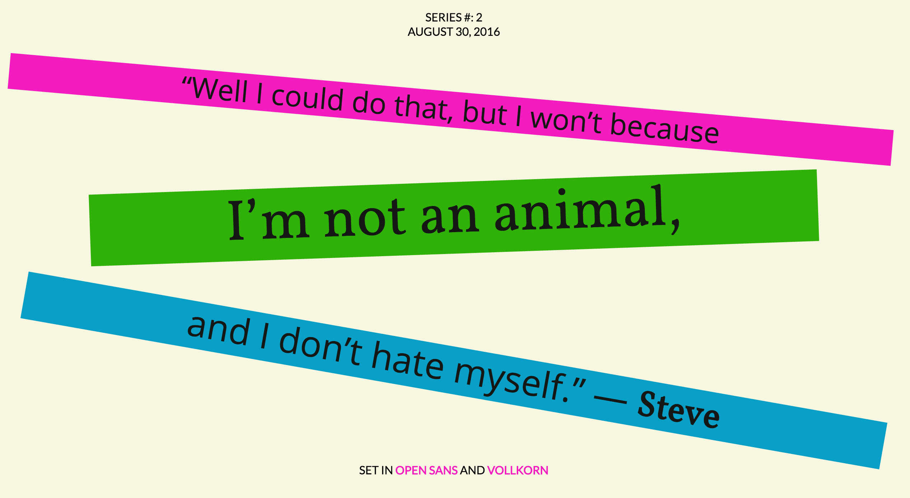

# Font-pairings

## Introduction
Every week for six weeks I'll be creating responsive and expressive layouts with pre-assigned font pairings and text snippets. The gh-pages for this repo will be a one-page compilation of all these projects. [gh-pages](https://swanie21.github.io/font-pairings/ )

Week one fonts:
[lato](https://fonts.google.com/specimen/Lato?category=Sans+Serif),
[unna](https://fonts.google.com/specimen/Unna?category=Serif,Sans+Serif&query=unna)

Week two fonts:
[open sans](https://fonts.google.com/specimen/Open+Sans),
[vollkorn](https://fonts.google.com/specimen/Vollkorn)
